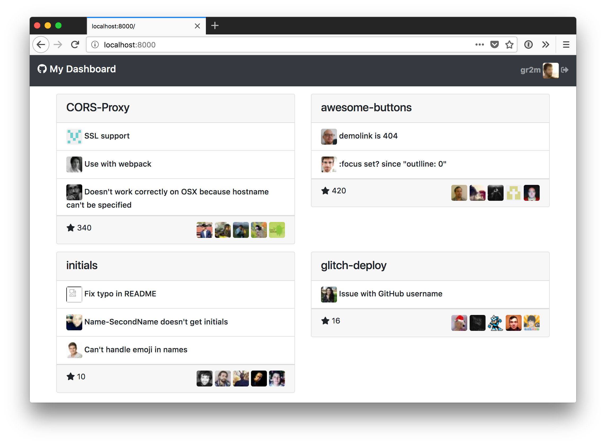

# GitHub GraphQL Demo

> An example GitHub dashboard implemented using REST & GraphQL for comparison

[](https://gr2m.github.io/github-graphql-demo)

This static HTML dashboard is to showcase the benefits of GitHub’s [GraphQL API](https://developer.github.com/v4/)
over its [REST API](https://developer.github.com/v3/).

The dashboard shows

* the authenticated user (based on [private access token](https://github.com/settings/tokens/new))
* A list of repositories (4 by default)
* For each repository
  * A list of recent issues (3 by default)
  * For each issue: Name and company for user tooltip
  * 5 most recent stargazers.
  * For each stargazer: Name and company for user tooltip

Using the Rest API, up to 42 request are required to render the dashboard.
GraphQL requires a single request which looks like that:

```graphql
query myGithubDashboard($numRepositories: Int = 4, $numIssues: Int = 3) {
  me: viewer {
    ...userInfo
    repositories(
      first: $numRepositories
      orderBy: { field: UPDATED_AT, direction: DESC }
      affiliations: OWNER
    ) {
      totalCount
      mostStarred: nodes {
        name
        url
        stargazers(last: 5) {
          totalCount
          mostRecent: nodes {
            ...userInfo
          }
        }
        issues(
          first: $numIssues
          states: [OPEN, CLOSED]
          orderBy: { field: UPDATED_AT, direction: DESC }
        ) {
          mostRecent: nodes {
            title
            url
            author {
              ...userInfo
            }
          }
        }
      }
    }
  }
}

fragment userInfo on User {
  login
  url
  avatarUrl(size: 30)
  name
  company
  location
}
```

You can run the query in the [GitHub GraphQL API](https://developer.github.com/v4/explorer/).

## License

[MIT](LICENSE)
